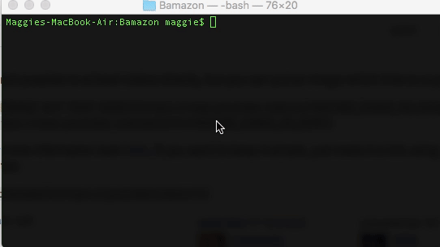
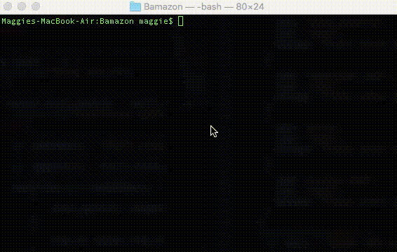

# Bamazon

## Customer Module

To run this module in the terminal enter:

node bamazonCustomer.js

The Bamazon Customer Portal allows users to view the current items available for purchase. The user will be prompted to enter the item id# and how many items they wish to purchase. If the item is in stock, the order will be completed and the user will see the total amount of their purchase.

## Manager Module

To run this module in the terminal enter:

node bamazonCustomer.js

The manager module lets managers view the list of products, view low inventory, add inventory, and add products.
 
  
**Technologies Used:**

* JavaScript
* node.js
* MySQL 

